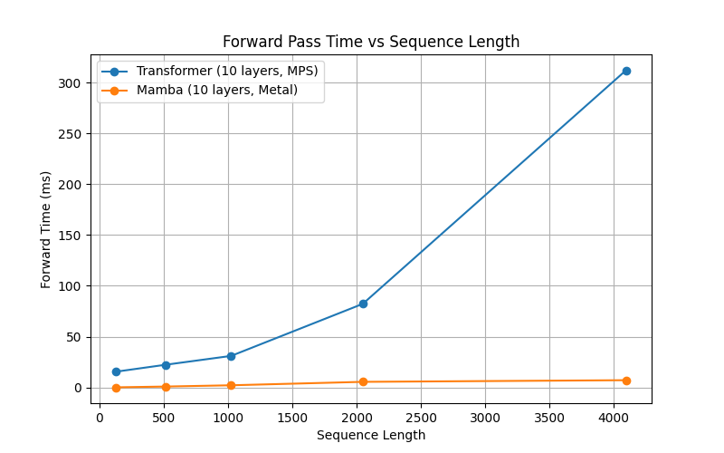

# 🚀 Mamba-Orin-Nano Custom S6: CUDA & Metal Accelerated SSM

## **Cross-Platform High-Performance Mamba SSM: CUDA + TensorRT Plugin + Metal S6 Kernel**


### **Jetson Orin Nano × macOS M1/M2/M3 Support**

From embedded edge devices to Apple Silicon, this project delivers a **cross-platform, highly optimized S6 kernel for Mamba Structured State Space Models (SSM)**.

Our goal is **"write the kernel once, run blazing fast everywhere"**—with a pinch of engineer's romance for recursive SSM acceleration.

---

# 🌟 Key Highlights

## 🔥 Jetson Orin Nano: CUDA + TensorRT Plugin

Custom **S6 recursive selective scan accelerator** optimized for **Ampere GPU**:

- **Custom CUDA S6 Kernel**

  - Shared memory & memory access reordering
  - Tiling to overcome long-sequence recursion
  - Register reuse to prevent spilling
  - Goal: let DRAM rest while compute works

- **TensorRT Plugin Integration**

  - Avoid graph breaks
  - Fuse with TensorRT-LLM GEMM
  - Supports FP16 / INT8 / INT4 quantization

- **Edge Device Optimization**

  - Zero-copy memory where appropriate
  - Asynchronous stream pipeline
  - SWAP and NVMe tuning

---

## 🍏 macOS: Metal S6 Benchmark (M1/M2/M3)

Same S6 recursive logic, implemented in **Metal Shading Language (MSL)**:

- Mirror CUDA S6 recursive operations
- **Unified Memory** eliminates CPU/GPU copies
- **FP16 half precision** acceleration
- Each thread handles a single channel (SIMD-friendly)
- Purpose: **Apple Silicon runs just as fast as CUDA FP16**

> CUDA: Muscle-heavy powerhouse.
> Metal: Sleek, elegant ninja.
> Both aim to make S6 recursion fly.

---

# 🧱 Project Structure (CUDA + Metal)

```
Mamba-Orin-Nano-Custom-S6-CUDA/
├── src/
│   ├── custom_s6_kernel/           # CUDA Kernel (.cu / .cuh)
│   ├── tensorrt_s6_plugin/         # TensorRT Plugin (.cpp / .hpp)
│   └── metal/                      # Metal S6 Kernel (.metal)
│       └── mamba_s6.metal
│
├── models/
│   └── mamba_weights/              # Model weights
│
├── scripts/
│   ├── convert_model.py
│   ├── build_tensorrt_engine.py
│   ├── run_inference.py
│   └── mamba_metal_benchmark.py
│
├── docs/
│   └── design_report.md
│
├── assets/
│   └── architecture_diagram.png
│
├── README.md
└── requirements.txt
```

---

# ⚙️ Installation & Setup

## 1️⃣ Jetson Orin Nano (CUDA + TensorRT)

**Requirements**

- JetPack (CUDA, cuDNN, TensorRT)
- Python 3.8+
- Build-essential / CMake

**Install Dependencies**

```bash
sudo apt update
sudo apt install -y build-essential

python3 -m venv venv
source venv/bin/activate
pip install -r requirements.txt
```

**Build CUDA Kernel & TensorRT Plugin**

```bash
cd src/tensorrt_s6_plugin
mkdir build && cd build
cmake .. -DCUDA_ARCHITECTURES="8.7"
make -j$(nproc)

export LD_LIBRARY_PATH=$LD_LIBRARY_PATH:$(pwd)
```

---

## 2️⃣ macOS (Metal S6 Benchmark)

**Requirements**

- macOS 12+
- M1 / M2 / M3
- Python 3.x

**Install Python Metal Bindings**

```bash
pip3 install numpy pyobjc-framework-Metal pyobjc-framework-Cocoa
```

**Run Metal S6 Benchmark**

```bash
python3 scripts/mamba_metal_benchmark.py
```

---

# 🚀 Expected Performance

## Jetson Orin Nano (FP16 / INT8)

| Method                                        | Key Optimization                 | Latency (ms/token) | Throughput  |
| --------------------------------------------- | -------------------------------- | ------------------ | ----------- |
| PyTorch baseline                              | Memory-bound S6                  | >40                | <25         |
| TensorRT-LLM                                  | GEMM fused                       | 10–20              | 50–100      |
| **This project: S6 Custom CUDA + TRT Plugin** | **Shared Mem + Tiling + Plugin** | **5–10**           | **100–200** |
| **INT8 Quantized**                            | **Quantization + custom kernel** | **<5**             | **>200**    |

## macOS Metal (M1/M2/M3)

- FP16 = native half precision
- Unified Memory = zero-copy
- Threadgroup = independent channels for SIMD efficiency

---

# 🧪 Quick Benchmark (Apple Silicon)



> Metal significantly outperforms default MPS implementation for long sequences.

---

# 💡 Why CUDA + Metal?

- Validate cross-platform consistency for S6 recursion
- Compare memory-bound vs compute-bound behavior
- Achieve **portable GPU backend**: same model, same logic, runs anywhere GPU is available

---

# 🤝 Contributing

- Bug reports
- Kernel optimization suggestions
- Other GPU backends (ROCm, Vulkan, etc.) welcome

---

# 📄 License

MIT License
