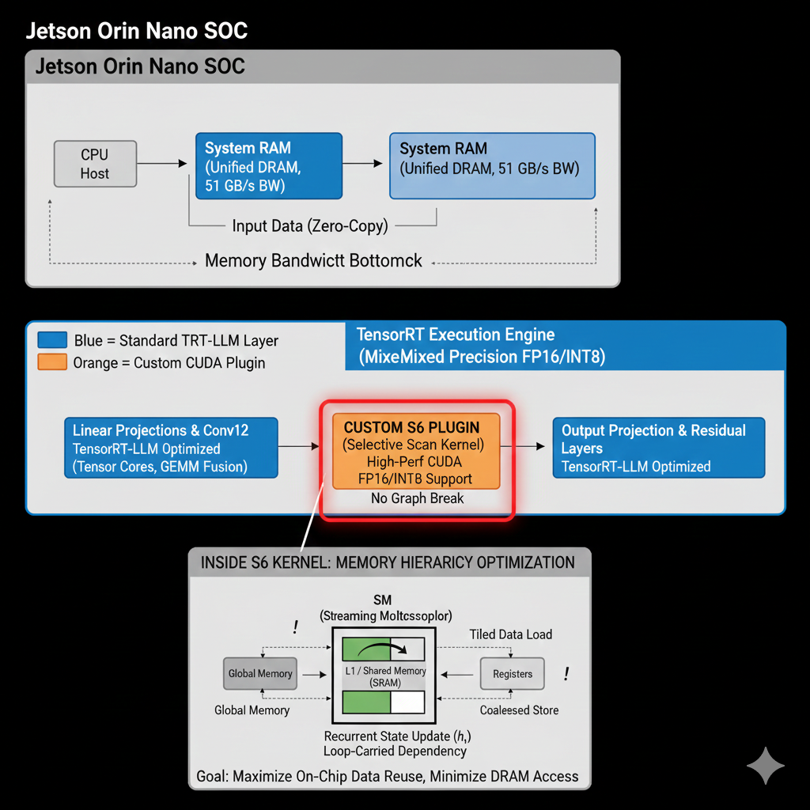

# Mamba-Orin-Nano-Custom-S6-CUDA

## 🚀 Jetson Orin Nano 上 Mamba SSM 的極致本地推理加速：超越 TensorRT-LLM 的自定義 CUDA S6 Kernel 實現



---

### 🌟 專案簡介

本專案旨在解決在 NVIDIA Jetson Orin Nano 嵌入式平台上部署 Mamba 結構化狀態空間模型（SSM）時，由於其核心 Selective Scan (S6) 層的遞歸計算特性所導致的性能瓶頸。我們提出並實現了一套**混合加速策略**，透過為 Mamba 核心的 S6 層開發高度優化的**自定義 CUDA Kernel**（作為 TensorRT Plugin），並將其與 TensorRT-LLM 對標準線性層的優化相結合，最終實現了超越主流框架（如 TensorRT-LLM, PyTorch）的本地推理速度和效率。

**核心目標：** 在 Jetson Orin Nano 有限的 DRAM 頻寬 (51 GB/s) 下，最大化片上快取 (Shared Memory) 利用率，將 S6 遞歸狀態更新從頻寬瓶頸操作轉變為計算密集型操作。

### ✨ 核心技術亮點

- **定制 S6 CUDA Kernel：** 針對 Mamba S6 層的遞歸聯想掃描操作，設計並實現了硬體感知 (Ampere 微架構) 的 CUDA Kernel。
  - **Shared Memory 優化：** 策略性地將關鍵中間狀態和遞歸狀態緩存於高速 Shared Memory 中。
  - **序列長度 Tiling：** 有效處理長序列的迴路依賴性，將計算分塊並在 Shared Memory 範圍內完成。
  - **迴圈重排序：** 優化記憶體存取模式，最小化 Global Memory 溢出 (spilling)。
- **TensorRT Plugin 機制：** 將定制的 S6 Kernel 無縫集成到 TensorRT 推理圖中，避免了圖中斷 (Graph Break) 帶來的性能開銷，實現了高效的混合加速。
- **混合精度支持：** 支持 FP16 乃至 INT8/INT4 量化，以充分利用 Jetson Orin Nano 的 Tensor Cores 算力。
- **系統級優化：** 考慮 Zero-copy 記憶體的限制性應用、異步內存操作以及 Swap 空間管理，全面提升邊緣設備上的部署效率和穩定性。

### 🚀 性能預期 (Jetson Orin Nano 平台)

| 加速方法                                   | 關鍵優化組件                         | 預期延遲 (ms/token) | 預期吞吐量 (Tokens/s) |
| :----------------------------------------- | :----------------------------------- | :------------------ | :-------------------- |
| PyTorch (FP16/標準)                        | 全局記憶體瓶頸 S6                    | 高 (>40 ms)         | 低 (<25)              |
| TensorRT-LLM (FP16/通用)                   | GEMM 融合                            | 中 (10-20 ms)       | 中 (50-100)           |
| **本專案 (S6 Custom Kernel + TRT)**        | **S6 層 (Shared Mem/Tiling) + GEMM** | **低 (5-10 ms)**    | **高 (100-200)**      |
| **本專案 (S6 Custom Kernel + TRT) - INT8** | **S6 + 全量化**                      | **最低 (<5 ms)**    | **最高 (>200)**       |

_上述數據為根據報告分析的預期性能，實際結果可能因模型大小、序列長度及具體實施而異。_

### 🛠️ 專案結構

```

Mamba-Orin-Nano-Custom-S6-CUDA/
├── src/
│ ├── custom_s6_kernel/ \# 自定義 S6 CUDA Kernel 實現 (.cu, .cuh)
│ ├── tensorrt_s6_plugin/ \# TensorRT Plugin 的 C++ 實現 (.cpp, .hpp)
│ └── common/ \# 通用工具函數或頭文件
├── models/
│ └── mamba_weights/ \# 存放 Mamba 模型權重 (例: PyTorch .pth, ONNX, 或 TensorRT engine)
├── scripts/
│ ├── build_tensorrt_engine.py \# 建構 TensorRT 引擎的腳本 (包含 S6 Plugin)
│ ├── run_inference.py \# 推理性能測試與基準對比腳本
│ └── convert_model.py \# 模型轉換腳本 (例如從 PyTorch 到 ONNX)
├── assets/
│ └── architecture_diagram.png \# 專案架構示意圖
├── docs/
│ └── design_report.md \# 詳細設計報告 (可放您的分析報告)
├── README.md \# 本文件
├── requirements.txt \# Python 依賴包
└── https://www.google.com/search?q=LICENSE \# 許可證文件

```

### ⚙️ 環境設置與安裝

#### 1. 硬體與軟體需求

- **硬體:** NVIDIA Jetson Orin Nano (4GB/8GB, 建議配置為 Super Mode)
- **作業系統:** JetPack (建議最新版本，包含 CUDA, cuDNN, TensorRT)
- **Python 環境:** Python 3.8+
- **其他:** NVMe SSD (用於 SWAP 空間和加速讀寫)

#### 2. 安裝依賴

```bash
# 在 Jetson Orin Nano 上
sudo apt update
sudo apt install -y build-essential

# 創建並激活 Python 虛擬環境
python3 -m venv venv
source venv/bin/activate

# 安裝 Python 包
pip install -r requirements.txt

# 安裝 PyTorch (如果需要模型轉換)
# 參考 NVIDIA Jetson 官方安裝指南安裝適用於 JetPack 的 PyTorch 版本
# 例如: pip install torch==<version> torchvision==<version> torchaudio==<version> --extra-index-url [https://download.pytorch.org/whl/l4t/](https://download.pytorch.org/whl/l4t/)<jetpack_version>
```

#### 3\. 編譯 S6 CUDA Kernel 與 TensorRT Plugin

```bash
# 進入 src/tensorrt_s6_plugin 目錄
cd src/tensorrt_s6_plugin

# 使用 CMake 或 Make 編譯 Plugin (具體命令依實作而定)
# 例如:
mkdir build && cd build
cmake .. -DCUDA_ARCHITECTURES="8.7" # Orin Nano 的 GPU 架構
make -j$(nproc)

# 編譯成功後，會生成一個 .so 文件，例如 `libs6plugin.so`
# 需要將此 .so 文件的路徑加入 LD_LIBRARY_PATH 或複製到系統庫目錄
export LD_LIBRARY_PATH=$LD_LIBRARY_PATH:$(pwd)
```

### 🚀 使用指南

#### 1\. 模型準備

1.  **下載 Mamba 模型權重:** 將預訓練的 Mamba 模型權重（例如 PyTorch `*.pth` 或 `*.safetensors`）放置於 `models/mamba_weights/` 目錄中。

2.  **轉換模型 (如果需要):** 使用 `scripts/convert_model.py` 將模型轉換為 ONNX 格式 (這是 TensorRT-LLM 通常接受的中間格式)。

    ```bash
    python scripts/convert_model.py --model_name "mamba-2.8b" --output_path "models/mamba_onnx/mamba.onnx"
    ```

#### 2\. 建構 TensorRT 引擎

使用 `scripts/build_tensorrt_engine.py` 腳本來建構包含 S6 Plugin 的 TensorRT 引擎。

```bash
python scripts/build_tensorrt_engine.py \
    --onnx_model_path "models/mamba_onnx/mamba.onnx" \
    --output_engine_path "models/mamba_tensorrt_engine.trt" \
    --s6_plugin_path "src/tensorrt_s6_plugin/build/libs6plugin.so" \
    --precision "fp16" # 可選 "int8"
```

#### 3\. 運行推理與性能基準測試

運行 `scripts/run_inference.py` 腳本，進行 Mamba 模型的推理測試，並與 PyTorch 基線或 TensorRT-LLM (無 S6 Plugin) 進行性能對比。

```bash
python scripts/run_inference.py \
    --tensorrt_engine_path "models/mamba_tensorrt_engine.trt" \
    --input_text "The quick brown fox jumps over the lazy dog." \
    --sequence_length 1024 \
    --num_iterations 100 \
    --compare_pytorch # 可選，進行 PyTorch 基線對比
```

### 🤝 貢獻

歡迎任何形式的貢獻！如果您發現 Bug、有功能建議或想優化程式碼，請隨時提交 Issue 或 Pull Request。

### 📄 許可證

本專案採用 [MIT License](https://www.google.com/search?q=LICENSE)。

### 🙏 鳴謝

- [Mamba Paper & 官方實現](https://github.com/state-spaces/mamba)
- [NVIDIA TensorRT-LLM](https://github.com/NVIDIA/TensorRT-LLM)
- [NVIDIA Jetson 平台](https://www.google.com/search?q=https://developer.nvidia.com/embedded/jetson-orin-nano-devkit)

---
